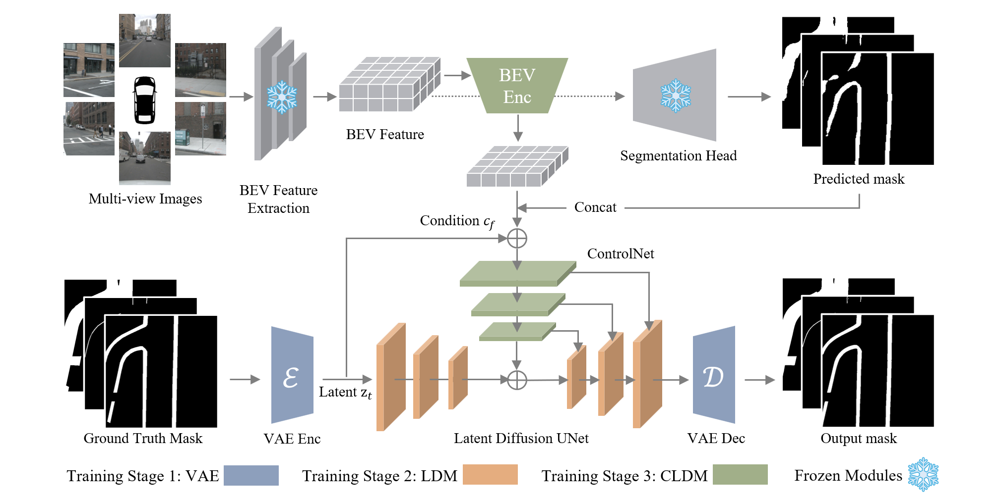

# CG-BEV: Conditional Generation of Bird's-Eye-View Segmentation Using BEV-optimised Diffusion

CG-BEV is a conditional generative framework for refining bird's-eye-view
(BEV) semantic segmentation from perception features and coarse predictions.
This repository contains the official training, evaluation, data preparation,
and benchmarking code.


## Overview

CG-BEV uses a three-stage training pipeline:

1. A variational autoencoder (VAE) learns the latent representation of BEV
   semantic maps.
2. A latent diffusion model (LDM) learns the unconditional BEV map prior.
3. CG-BEV conditions the generative prior on BEV features and coarse semantic
   predictions from a perception backbone.

The unified entry points support VAE, LDM, CG-BEV, and optional end-to-end
training or evaluation. The CLI keeps `cldm` as the task identifier for the
conditional latent diffusion stage.



## Environment Setup

Our code has been tested and runs successfully with Python 3.8 and PyTorch 1.12. Older versions may also work, but have not been tested. We recommend the following newer environment setup:

```bash
conda create -n cgbev python=3.12 -y
pip install torch==2.7.1 torchvision==0.22.1 --index-url https://download.pytorch.org/whl/cu128
pip install -r requirements.txt
```
Run the installation commands inside the `cgbev` environment.

## Data Preparation

This repository requires the **original nuScenes dataset** and three types of
BEV segmentation data: 
- BEV semantic map ground truth (at 192 × 192 and 512 × 512 resolution)
- BEV features inferred by the baseline model
- BEV semantic map prediction inferred by the baseline model.

1. Download nuScenes from the [official download page](https://www.nuscenes.org/nuscenes#download). Only the **Camera blobs** are required; download and extract them under `data/nuscenes/`.
2. Prepare BEV segmentation map ground truth at both resolutions. You can generate it with `tools/generate_bev_gt.py` (see below) or download our pre-generated packages.
3. Download the pre-inferenced BEV features and segmentation prediction. To use other baselines, generate its features and predictions yourself.

| Data | Description | Download |
| --- | --- | --- |
| BEV seg map GT (192 × 192) | Pre-generated semantic-map ground truth | TBA |
| BEV seg map GT (512 × 512) | Pre-generated semantic-map ground truth | TBA |
| LSS package | Pre-generated BEV features and prediction maps | TBA |
| BEVFusion package | Pre-generated BEV features and prediction maps | TBA |

To generate semantic ground-truth masks yourself, run:

```bash
python tools/generate_bev_gt.py \
  --ds-version v1.0-trainval \
  --data-split train \
  --resolution 192
```

Arrange the raw nuScenes and prepared/generated data as follows:

```text
data/nuscenes/
├── samples/
├── maps/
├── can_bus/
├── v1.0-trainval/
├── bev_seg_gt_mask_192/
│   ├── train/
│   └── val/
├── bev_seg_gt_mask_512/
│   ├── train/
│   └── val/
├── bev_feat_<baseline>/
│   ├── train/*.pt
│   └── val/*.pt
├── bev_pred_<baseline>/
│   ├── train/*.npy
│   └── val/*.npy
├── prompt_<baseline>_train.json
└── prompt_<baseline>_val.json
```

For the provided packages, `<baseline>` is either `lss` or `bevfusion`.


## Pretrained models

The download links are placeholders and will be updated with the public model
release.

| Model | Output resolution | mIoU | Download |
| --- | ---: | --- | --- |
| VAE | — | --- | TBA |
| LDM | 192 × 192 | --- | TBA |
| CG-BEV | 192 × 192 | --- | TBA |
| LDM | 512 × 512 | --- | TBA |
| CG-BEV | 512 × 512 | --- | TBA |

Place downloaded weights in `ckpts/`. Update the checkpoint paths in the YAML
configuration or pass them through the command line.

## Training

Train the three stages in order:

```bash
# Stage 1: VAE
python train.py --task vae --config configs/cldm_res_192.yaml

# Stage 2: unconditional LDM
python train.py --task ldm --config configs/ldm_res_192.yaml

# Stage 3: CG-BEV with a selected perception baseline
python train.py --task cldm \
  --config configs/cldm_res_192.yaml \
  --baseline lss \
  --ldm-ckpt ckpts/ldm_192.ckpt
```

Use `--init-weights` to warm-start weights without optimizer state, or
`--resume-state` to restore a complete PyTorch Lightning training state.
Training outputs are written to timestamped subdirectories under `logs/`.

For 512 × 512 training, use `configs/ldm_res_512.yaml` and
`configs/cldm_res_512.yaml` with matching checkpoints and generated masks.

## Evaluation

Evaluate a CG-BEV checkpoint on the nuScenes validation split:

```bash
python test.py --task cldm \
  --config configs/cldm_res_192.yaml \
  --ckpt ckpts/cgbev_192.ckpt \
  --baseline lss \
  --split val
```

Add `--save-vis` to save qualitative results or `--measure-speed` to report
latency, throughput, parameter counts, memory use, and profiler-supported
FLOPs. Evaluation outputs are stored under `logs/`.

## Citation

The citation entry will be added with the camera-ready paper release.

## License

This project is released under the [Apache License 2.0](LICENSE).
